# NUTC 投票系統 — 完整流程圖

以 Mermaid flowchart 語法呈現整套系統的完整生命週期：選舉建立、身分綁定、
投票、批次送出、開票、公告、新一輪重置。GitHub 與大多數 Markdown
編輯器（VS Code、Typora 等）可直接渲染下方的 mermaid 區塊。

```mermaid
flowchart TD
    subgraph P0["階段 0：選舉建立（Admin）"]
        A1[Admin 新增選民名冊] --> A2["本地生成 OTP + H(OTP)"]
        A2 --> A3["只送 H(OTP) 給 CA<br/>建立 voter_registry（狀態：pending）"]
        A3 --> A4["OTP 明文透過信件／QR code<br/>派發給選民（系統外管道）"]
        A4 --> A5[Admin 觸發 start_election]
        A5 --> A6["TA：election_state = running<br/>設定投票截止時間"]
    end

    subgraph P1["階段 1：身分綁定（Voter → CA）"]
        B1[選民瀏覽器本地生成 RSA-2048 金鑰對] --> B2["用私鑰簽章 PoP<br/>REGISTER｜voter_id｜timestamp"]
        B2 --> B3["送出 公鑰 + OTP + PoP 至 CA"]
        B3 --> B4{"CA 驗證<br/>H(OTP) 相符？PoP 簽章正確？"}
        B4 -->|失敗| B5["拒絕（OTP_INVALID／POP_INVALID 等）"]
        B4 -->|成功| B6["CA 核發憑證<br/>狀態改為 registered"]
        B6 --> B7["憑證＋私鑰存本機 IndexedDB<br/>（私鑰永不上傳）"]
    end

    subgraph P2["階段 2：投票認證與取簽（Voter ↔ TPA）"]
        C1[選民選擇候選人] --> C2["向 TPA 發出雙向認證請求（Phase 2）"]
        C2 --> C3{"TPA 檢查<br/>nonce 未重放？<br/>尚未消耗過 Voting Token？<br/>憑證合法？"}
        C3 -->|拒絕| C4["NONCE_REPLAY／ALREADY_VOTED／<br/>CERT_INVALID 等"]
        C3 -->|通過| C5[核發 Voting Token]
        C5 --> C6["本地計算 m = H(H(voter_id｜sn｜candidate)｜candidate)"]
        C6 --> C7["FDH 擴展 + RSA 盲化 → m'"]
        C7 --> C8["向 TPA 請求盲簽章（附 Voting Token）"]
        C8 --> C9{"Token 是否 used = 0？"}
        C9 -->|已用過| C10[拒絕，無法重複取簽]
        C9 -->|未用| C11["TPA 對 m' 盲簽<br/>Token 標記 used = 1"]
        C11 --> C12["選民去盲化得 S'<br/>本地驗證 S'^e mod n == FDH(m)"]
    end

    subgraph P3["階段 3：封裝與批次送出（Voter → CC）"]
        D1["內層：RSA-OAEP 加密<br/>(innerHash｜candidate) 給 TA 公鑰"] --> D2["組 AES 明文 = 內層密文｜S'｜m_hex"]
        D2 --> D3["AES-GCM 加密（隨機金鑰 k）"]
        D3 --> D4["RSA-OAEP 加密 k 給 CC 公鑰 → c_key"]
        D4 --> D5["提交數位信封至本機佇列<br/>pending_envelope"]
        D5 --> D6{"湊滿批次量（預設10封）<br/>或快到截止時間？"}
        D6 -->|否，繼續累積| D5
        D6 -->|是| D7["打亂順序，批次一次送出給 CC<br/>（避免提交時間點洩漏投票行為）"]
    end

    subgraph P4["階段 4：開票（CC ↔ TA）"]
        E1["CC 收到信封，記錄至 envelopes"] --> E2["截止後，Admin 觸發 /api/tally"]
        E2 --> E3["CC 向 TA 請求釋放 SK_TA"]
        E3 --> E4{"TA 檢查<br/>選舉已啟動？已過截止時間？"}
        E4 -->|未截止| E5["拒絕 NOT_YET_DEADLINE"]
        E4 -->|通過| E6["TA 釋放私鑰 SK_TA"]
        E6 --> E7["CC 用 SK_TA 解密每封信封的內層"]
        E7 --> E8["驗證盲簽章數學正確性<br/>+ token_hash 去重（防重複計票）"]
        E8 --> E9["統計各候選人得票<br/>建構 Merkle Tree"]
        E9 --> E10["CC 對 PacketResult 數位簽章"]
        E10 --> E11[推送結果至 BB]
    end

    subgraph P5["階段 5：公告與驗證（BB）"]
        F1["BB 驗證 CC 簽章＋憑證鏈＋<br/>票數/長度一致性"] --> F2{驗證通過？}
        F2 -->|否| F3[拒絕公告]
        F2 -->|是| F4["公告 Tally + 選票雜湊清單 + Merkle Root"]
        F4 --> F5["任何人皆可用 m_hex 到 /verify 查詢<br/>是否已計入（無需登入、無需證明身分）"]
    end

    subgraph P6["階段 6：新一輪重置（Admin /api/new_round）"]
        G1[Admin 觸發新一輪重置] --> G2["TA：回到 standby，清除截止時間"]
        G2 --> G3["TPA：清除 issued_tokens／used_nonces"]
        G3 --> G4["Voter：清除本機 pending_envelope 佇列"]
        G4 --> G5["CA：清除 voter_registry"]
        G5 --> G6["CC：清除 envelopes／valid_votes／tally_state"]
        G6 --> G7["BB：清除 published_votes／bb_state"]
        G7 --> G8[Admin：清除本地選民名冊]
    end

    A6 --> B1
    B7 --> C1
    C12 --> D1
    D7 --> E1
    E11 --> F1
    F5 -.可重複開啟下一輪.-> G1
    G8 -.回到選舉建立.-> A1
```

## 各階段對應的服務與資料表

| 階段 | 主要服務 | 關鍵資料表 |
|---|---|---|
| 0 選舉建立 | Admin、CA | `voter_roster`（Admin）、`voter_registry`（CA） |
| 1 身分綁定 | CA | `voter_registry` |
| 2 投票認證與取簽 | TPA | `issued_tokens`、`used_nonces`、`blind_sign_log` |
| 3 封裝與批次送出 | Voter | `pending_envelope` |
| 4 開票 | CC、TA | `envelopes`、`valid_votes`、`used_token_hashes`、`tally_state`（CC）、`election_state`、`key_release_log`（TA） |
| 5 公告與驗證 | BB | `published_votes`、`bb_state` |
| 6 新一輪重置 | 全部 | 見 `admin_tool/app.py` 的 `/api/new_round` |
